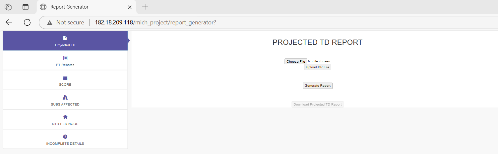
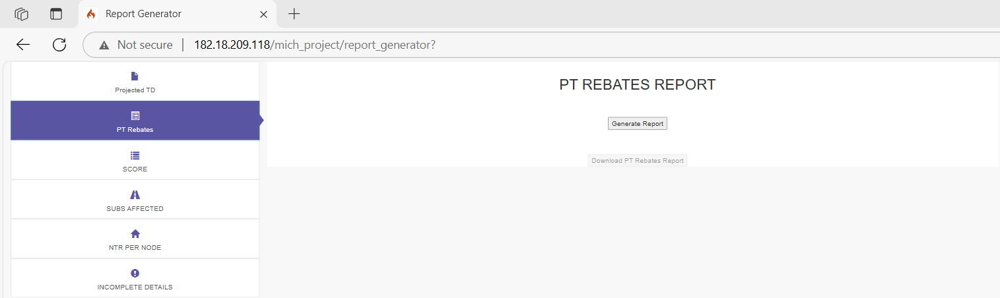
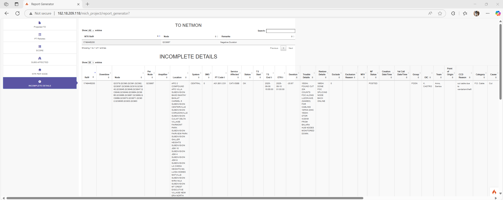
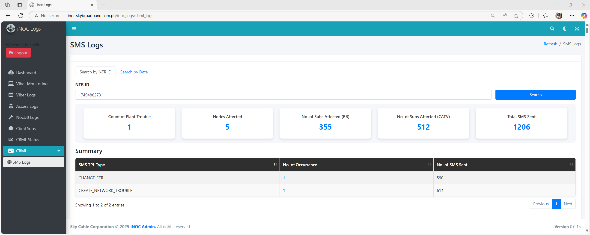
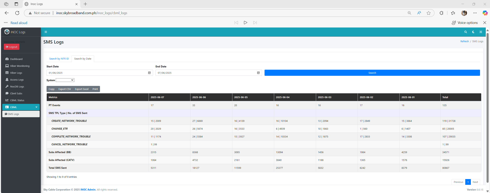

# 👋 Hello, I'm Michelle Pamin

🎓 Licensed Electronics Engineer & Electronics Technician  
🛠️ Experienced NOC Engineer (8+ years)  
💻 Passionate Developer | Automation Enthusiast | Data Explorer

---

## 💼 About Me

I'm a licensed **Electronics Engineer and Technician** with over **8 years of experience** working as a **Network Operations Center (NOC) Engineer**. In 2023, I transitioned into **software development** and **data analytics**, bringing my analytical mindset and problem-solving skills to the world of programming and automation.

---

## 🧠 What I Do

- 🌐 **Web Development** (PHP, HTML, CSS, JavaScript)
- 🐍 **Python Automation & Data Analytics**  
- 🚀 **DevOps Enthusiast** –  
  - Version control with **Git & GitHub**  
  - Server-side scripting on **Linux** environments  
  - Exploring **CI/CD pipelines** with **Jenkins** and **GitHub Actions**  
  - Containerization using **Docker** for easier deployment  
- 🔧 **Network Monitoring & Incident Response**  
- 📊 **KPI Reporting & Dashboard Creation**  
- 🛠️ **Process Automation** (Excel macros, Python scripts, CRON jobs)

---

## 🚀 Tools & Technologies

---

## 📂 Featured Projects

Here are some of the things I've been working on:

### 🔹 1. Report Generator
I created a web-based report generation tool that enables users to create reports requested by stakeholders with ease. Its primary purpose is to empower any team member to generate and send reports independently, eliminating the need to rely solely on a specific individual with specialized knowledge.

### 🔹 2. Automation Scripts
I designed and implemented Python automation scripts to streamline the generation of recurring reports. The solution replaced manual, time-consuming tasks, and reduced the average report preparation time from 50 minutes to just 5 minutes. This significantly improved efficiency, minimized human error, and allowed team members to focus on more strategic responsibilities.

### 🔹 3. SMS Logs
I designed and developed a front-end web interface to provide visibility into SMS notification activity. The system displays the number of SMS alerts sent per event type, tracks the frequency of events on a daily basis, and allows users to extract and view detailed SMS logs directly from the underlying database. This tool enhances operational monitoring, supports performance analysis, and enables faster incident auditing for the team.

_✨ More coming soon – stay tuned!_

---

## 🎮 Hobbies & Fun Stuff

When I'm not coding, you’ll find me:

- 🎮 Playing mobile & computer games  
- 🌍 Traveling to new places  
- 🥘 Food tripping & cafe hopping  
- ⛰️ Hiking & cycling outdoors  

---

## 📫 Let's Connect!

Feel free to check out my repositories or connect with me:

- 🌐 LinkedIn: https://www.linkedin.com/in/michelle-pamin/  
- 📨 Email: michelle.pamin@gmail.com

Thanks for stopping by! 💖
